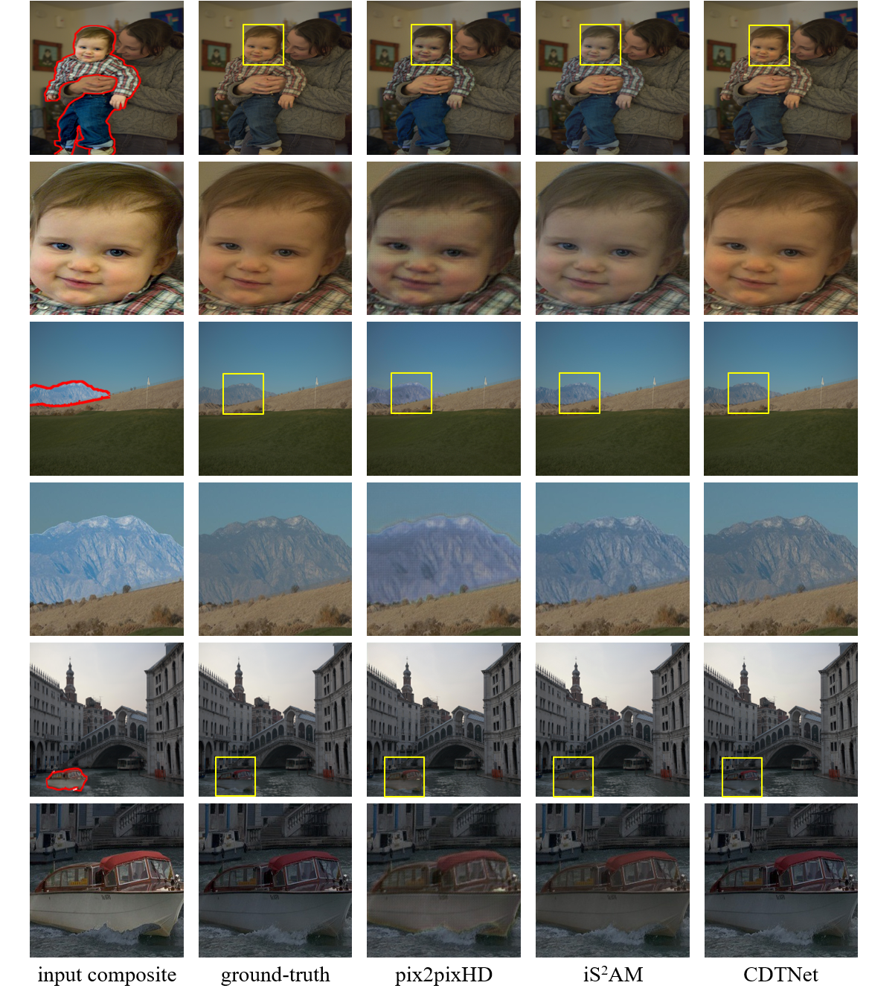

# CDTNet-High-Resolution-Image-Harmonization

This is the official repository for the following paper:

> **High-Resolution Image Harmonization via Collaborative Dual Transformations**  [[arXiv]](https://arxiv.org/abs/2109.06671) 
>
> Wenyan Cong, Xinhao Tao, Li Niu, Jing Liang, Xuesong Gao, Qihao Sun, Liqing Zhang 
> Accepted by **CVPR2022**.

We propose a high-resolution image harmonization network named **CDTNet** to combine pixel-to-pixel transformation and RGB-to-RGB transformation coherently in an end-to-end framework. As shown in the image below, our CDTNet consists of a low-resolution generator for pixel-to-pixel transformation, a color mapping module for RGB-to-RGB transformation, and a refinement module to take advantage of both. 

  

 Unfortunately, code and model are not allowed to be released due to the collaboration with Hisense, but our network could be easily reimplemented based on the public [code sources](#codesource). We provide two datasets used in our paper. We will provide the harmonization results of our method for comparison. More results for comparison are available upon request. 

## Datasets

### 1. HAdobe5k

HAdobe5k is one of the four synthesized sub-datasets in [iHarmony4](https://github.com/bcmi/Image-Harmonization-Dataset-iHarmony4) dataset, which is the benchmark dataset for image harmonization. Specifically, HAdobe5k is generated based on [MIT-Adobe FiveK](<http://data.csail.mit.edu/graphics/fivek/>) dataset and contains 21597 image triplets (composite image, real image, mask) as shown below, where 19437 triplets are used for training and 2160 triplets are used for test. Official training/test split could be found in **[Baidu Cloud](https://pan.baidu.com/s/1NAtLnCdY1-4uxRKB8REPQg)** [**(Alternative_address)**](https://cloud.bcmi.sjtu.edu.cn/sharing/eBXLV8iU5).

MIT-Adobe FiveK provides with 6 retouched versions for each image, so we manually segment the foreground region and exchange foregrounds between 2 versions to generate composite images. High-resolution images in HAdobe5k sub-dataset are with random resolution from 1296 to 6048, which could be downloaded from **[Baidu Cloud](https://pan.baidu.com/s/1NAtLnCdY1-4uxRKB8REPQg)** [**(Alternative_address)**](https://cloud.bcmi.sjtu.edu.cn/sharing/eBXLV8iU5).

### 2. 100 High-Resolution Real Composite Images

Considering that the composite images in HAdobe5k are synthetic composite images, we additionally provide 100 high-resolution real composite images for qualitative comparison in real scenarios with image pairs (composite image, mask), which are generated based on [Open Image Dataset V6](https://storage.googleapis.com/openimages/web/index.html) dataset and [Flickr](https://www.flickr.com). 

Open Image Dataset V6 contains ~9M images with 28M instance segmentation annotations of 350 categories, where enormous images are collected from Flickr and with high resolution. So the foreground images are collected from the whole Open Image Dataset V6, where the provided instance segmentations are used to crop the foregrounds. The background images are collected from both Open Image Dataset V6 and Flickr, considering the resolutions and semantics. Then cropped foregrounds and background images are combined using PhotoShop, leading to obviously inharmonious composite images.

100 high-resolution real composite images are with random resolution from 1024 to 6016, which could be downloaded from **[Baidu Cloud](https://pan.baidu.com/s/1fTfLBMxb7sAKtbpQVsfh8g)** (access code: vnrp) [**(Alternative_address)**](https://cloud.bcmi.sjtu.edu.cn/sharing/c9frU77Il).

## Results

#### 1. High-resolution (1024&times;1024 and 2048&times;2048) results on HAdobe5k test set
We test our CDTNet on 1024&times;1024 and 2048&times;2048 images from HAdobe5k dataset and report the harmonization performance based on MSE, PSNR, fMSE,  and SSIM. Here we also release all harmonized results on both resolutions. Due to JPEG compression, the performance tested on our provided results would be not surprisingly worse than our reported performance.

<table class="tg">
  <tr>
    <th class="tg-0pky" align="center">Image Size</th>
    <th class="tg-0pky" align="center">Model</th>
    <th class="tg-0pky" align="center">MSE</th>
    <th class="tg-0pky" align="center">PSNR</th>
    <th class="tg-0pky" align="center">fMSE</th>
    <th class="tg-0pky" align="center">SSIM</th>
    <th class="tg-0pky" align="center">Test Images Download</th>
  </tr>
  <tr>
    <td class="tg-0pky" align="center">1024&times;1024</td>
    <td class="tg-0pky" align="center">CDTNet-256</td>
    <td class="tg-0pky" align="center">21.24</td>
    <td class="tg-0pky" align="center">38.77</td>
    <td class="tg-0pky" align="center">152.13</td>
    <td class="tg-0pky" align="center">0.9868</td>
    <td class="tg-0pky" align="center"><a href="https://pan.baidu.com/s/1Twu5YaPeOTQfzOyNNPbSXw">Baidu Cloud</a> (access code: o1bl) </td>
  </tr>
  <tr>
    <td class="tg-0pky" align="center">2048&times;2048</td>
    <td class="tg-0pky" align="center">CDTNet-512</td>
    <td class="tg-0pky" align="center">23.35</td>
    <td class="tg-0pky" align="center">38.45</td>
    <td class="tg-0pky" align="center">159.13</td>
    <td class="tg-0pky" align="center">0.9853</td>
      <td class="tg-0pky" align="center"><a href="https://pan.baidu.com/s/13IK819ruV2Cmoep_LaLFrA">Baidu Cloud</a> (access code: f4db) </td>
  </tr>
</table>

We show several results on 1024&times;1024 resolution below, where yellow boxes zoom in the particular regions for a better observation.

#### 2. High-resolution (1024&times;1024) results on 100 real composite images 

We test our CDTNet on 100 high-resolution real composite images as mentioned above, and provide the results on [Baidu Cloud](https://pan.baidu.com/s/1U0rIBfx-kOQgHcT5dDunJg) (access code: nfvw).

#### 3. Low-resolution (256&times;256) results on iHarmony4 test set

We also test our CDTNet on 256&times;256 images from iHarmony4 dataset and compare the results with iS2AM. Note that the performance of iS2AM is tested using its publicly released model on [[GitHub]](https://github.com/saic-vul/image_harmonization). We also provide all harmonized results on [Baidu Cloud](https://pan.baidu.com/s/1baIBBBV8bTqAeLYOSTXSOA#list/path=%2F) (access code: qiam).

<table class="tg">
  <tr>
    <th class="tg-0pky"  align="center">Sub-dataset</th>
    <th class="tg-0pky" colspan="2" align="center">HCOCO</th>
    <th class="tg-0pky" colspan="2" align="center">HAdobe5k</th>
    <th class="tg-0pky" colspan="2" align="center">HFlickr</th>
    <th class="tg-0pky" colspan="2" align="center">Hday2night</th>
    <th class="tg-0pky" colspan="2" align="center">All</th>
  </tr>
  <tr>
    <td class="tg-0pky" align="center">Evaluation metric</td>
    <td class="tg-0pky" align="center">MSE</td>
    <td class="tg-0pky" align="center">PSNR</td>
    <td class="tg-0pky" align="center">MSE</td>
    <td class="tg-0pky" align="center">PSNR</td>
    <td class="tg-0pky" align="center">MSE</td>
    <td class="tg-0pky" align="center">PSNR</td>
    <td class="tg-0pky" align="center">MSE</td>
    <td class="tg-0pky" align="center">PSNR</td>
    <td class="tg-0pky" align="center">MSE</td>
    <td class="tg-0pky" align="center">PSNR</td>
  </tr>
  <tr>
    <td class="tg-0pky" align="center">iS2AM</td>
    <td class="tg-0pky" align="center">16.48</td>
    <td class="tg-0pky" align="center">39.16</td>
    <td class="tg-0pky" align="center">22.60</td>
    <td class="tg-0pky" align="center">37.24</td>
    <td class="tg-0pky" align="center">69.67</td>
    <td class="tg-0pky" align="center">33.56</td>
    <td class="tg-0pky" align="center">40.59</td>
    <td class="tg-0pky" align="center">37.72</td>
    <td class="tg-0pky" align="center">24.65</td>
    <td class="tg-0pky" align="center">37.95</td>
  </tr>
  <tr>
    <td class="tg-0pky" align="center">CDTNet-256</td>
    <td class="tg-0pky" align="center">16.25</td>
    <td class="tg-0pky" align="center">39.15</td>
    <td class="tg-0pky" align="center">20.62</td>
    <td class="tg-0pky" align="center">38.24</td>
    <td class="tg-0pky" align="center">68.61</td>
    <td class="tg-0pky" align="center">33.55</td>
    <td class="tg-0pky" align="center">36.72</td>
    <td class="tg-0pky" align="center">37.95</td>
    <td class="tg-0pky" align="center">23.75</td>
    <td class="tg-0pky" align="center">38.23</td>
  </tr>
</table>

#### 4. Low-resolution (256&times;256) results on 99 real composite images

We also test our CDTNet on another 99 real composite images used in [previous works](https://github.com/bcmi/Image-Harmonization-Dataset-iHarmony4), and provide the results on [Baidu Cloud](https://pan.baidu.com/s/1djl8dHqzbZg893fUf6zImw) (access code: i6e8).

## Other Resources

+ [Awesome-Image-Harmonization](https://github.com/bcmi/Awesome-Image-Harmonization)
+ [Awesome-Image-Composition](https://github.com/bcmi/Awesome-Image-Composition)

## Acknowledgement 

Our code is heavily borrowed from [iSSAM](https://github.com/saic-vul/image_harmonization) and [3D LUT](https://github.com/HuiZeng/Image-Adaptive-3DLUT).
