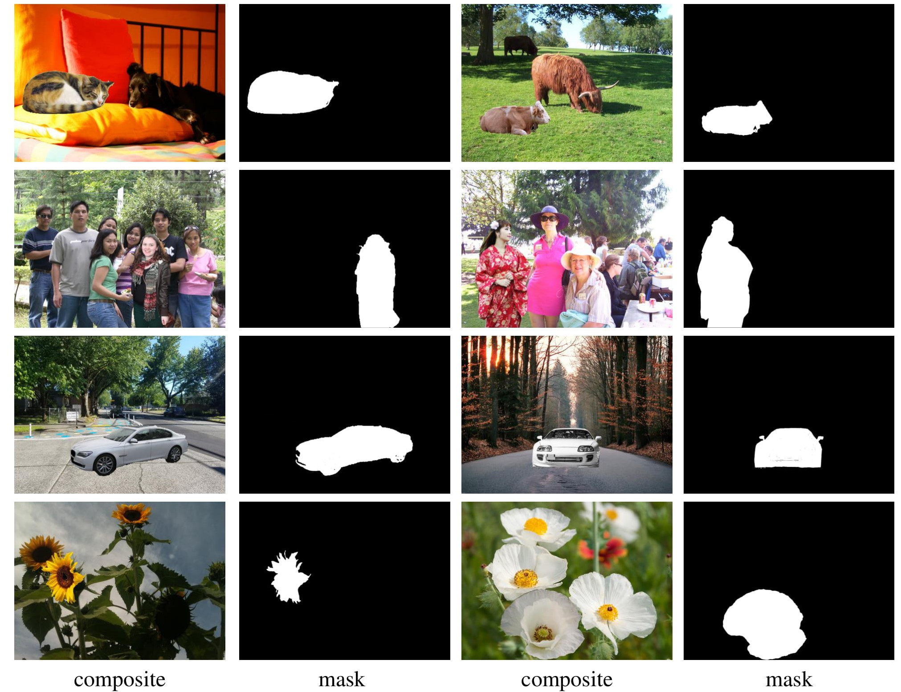

# CDTNet-High-Resolution-Image-Harmonization
Dataset for high-resolution image harmonization.

### 1. HAdobe5k

HAdobe5k is a synthesized harmonization dataset generated based on [MIT-Adobe FiveK](<http://data.csail.mit.edu/graphics/fivek/>) dataset with image triplets (composite image, real image, mask). 

MIT-Adobe FiveK provides with 6 retouched versions for each image, so we manually segment the foreground region and exchange foregrounds between 2 versions to generate composite images.

High-resolution images in HAdobe5k sub-dataset are with random resolution from 1296 to 6048, which could be downloaded from **[Baidu Cloud](https://pan.baidu.com/s/1NAtLnCdY1-4uxRKB8REPQg)** [**(Alternative_address)**](https://cloud.bcmi.sjtu.edu.cn/sharing/eBXLV8iU5).

### 2. 100 High-Resolution Real Composite Images

100 high-resolution real composite images are used for qualitative comparison in real scenarios with image pairs (composite image, mask), which are generated based on [Open Image Dataset V6](https://storage.googleapis.com/openimages/web/index.html) dataset and [Flickr](https://www.flickr.com). 

Open Image Dataset V6 contains ~9M images with 28M instance segmentation annotations of 350 categories, where enormous images are collected from Flickr and with high resolution. So the foreground images are collected from the whole Open Image Dataset V6, where the provided instance segmentations are used to crop the foregrounds. The background images are collected from both Open Image Dataset V6 and Flickr, considering the resolutions and semantics. Then cropped foregrounds and background images are combined using PhotoShop, leading to obviously inharmonious composite images.

100 high-resolution real composite images are with random resolution from 1024 to 6016, which could be downloaded from **[Baidu Cloud](https://pan.baidu.com/s/1fTfLBMxb7sAKtbpQVsfh8g) ** (access code: vnrp) [**(Alternative_address)**](https://cloud.bcmi.sjtu.edu.cn/sharing/c9frU77Il).

